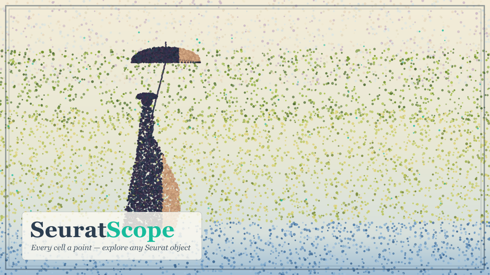

<p align="center">
  
</p>

# SeuratScope

An R Shiny app for interactively exploring **any Seurat object** — single-cell, standard spatial, or Visium HD — no coding required.

Load a Seurat `.RDS` file and explore it through QC, UMAP embeddings, gene expression, spatial maps, cell-type composition, and metadata. The interface adapts to what your object actually contains, and every plot is publication-ready and exports to PDF or PNG.

> *Named after Georges Seurat, the father of pointillism — because in single-cell data, as in his paintings, every point is a cell.*

---

## Features

| Tab | What it does |
|---|---|
| **QC** | `nCount` / `nFeature` / `percent.mt` violins and feature scatter — auto-detected from metadata. |
| **UMAP / Reduction** | `DimPlot` and `FeaturePlot` on any reduction — clusters, genes, module scores, or 2-gene co-expression. |
| **Feature Expression** | Violin, box, dot, and heatmap plots for genes and/or module scores, grouped by any metadata column, with optional statistics. |
| **Spatial** | Clusters, gene expression, or module/UCell scores over tissue images *(shown only when the object has images)*. |
| **Composition** | Stacked/grouped bar charts of cell-type or cluster makeup per sample. |
| **Metadata** | Bar charts, histograms, density plots, and a searchable data table. |

**Across the whole app:**

- **Adaptive interface** — only the tabs your object supports appear; the Spatial tab hides for data without images, and the most relevant tab opens first.
- **Split by** — split UMAP, spatial, and expression plots by sample or condition.
- **Correct cluster ordering** — clusters sort numerically (0, 1, 2 … 10, 11), not alphabetically.
- **Custom group order** — drag clusters into any sequence you like; colours stay locked to each cluster's identity.
- **25 colour palettes + your own** — a built-in 60-colour palette, 14 GraphPad Prism palettes via [ggprism](https://csdaw.github.io/ggprism/), and 5 ColorBrewer sets, or add your own by pasting hex codes / uploading a colour file.
- **Per-tab themes** — Classic, Prism, Minimal, or Black & White, chosen independently for each plot.
- **Prism-style statistics** — Wilcoxon or t-test with significance brackets on violin and box plots.
- **Biologist-friendly labels** — reports *cells*, *spots*, or *bins* as appropriate, and *genes* rather than *features*; Visium HD bin size (8 µm / 16 µm) is auto-detected.
- **Module & UCell scores** — anything numeric in `meta.data` plots exactly like a gene, with continuous and diverging colour scales.
- **Export anything** — every plot saves as PDF (vector) or PNG at a width and height you specify.
- **Friendly & interactive** — guided welcome screen, progress bar on load, loading spinners, an at-a-glance object summary, and tooltips.

---

## Supported data

The interface adapts to each object:

| Data type | QC | UMAP | Expression | Spatial | Composition / Metadata |
|---|:---:|:---:|:---:|:---:|:---:|
| scRNA-seq / snRNA-seq | ✅ | ✅ | ✅ | — | ✅ |
| Standard Visium (spots) | ✅ | ✅ | ✅ | ✅ | ✅ |
| Visium HD (8 µm / 16 µm bins) | ✅ | ✅ | ✅ | ✅ | ✅ |

If your object has multiple assays (e.g. `Spatial.008um` and `sketch`), switch between them with the **Active Assay** selector in the sidebar.

---

## Requirements

- **R ≥ 4.2** (developed on R 4.5.2)
- Enough RAM to hold your Seurat object. Most scRNA objects are a few GB; Visium HD objects are larger — a 16 µm binned object may need ~8–16 GB, and an 8 µm object can exceed 24 GB.

---

## Installation

```bash
git clone https://github.com/IkjotSidhu/SeuratScope.git
cd SeuratScope
Rscript install_packages.R
```

The installer pulls everything from CRAN and skips anything already present.

<details>
<summary><b>Seurat installation trouble?</b></summary>

Seurat depends on system libraries that may need installing first.

**macOS** (with [Homebrew](https://brew.sh)):
```bash
brew install hdf5 gdal geos proj
```

**Ubuntu / Debian:**
```bash
sudo apt-get install libhdf5-dev libgdal-dev libgeos-dev libproj-dev
```

Then re-run `Rscript install_packages.R`.
</details>

---

## Usage

Launch from a terminal:

```bash
Rscript launch_app.R
```

Or from an R console / RStudio:

```r
shiny::runApp("app.R", launch.browser = TRUE)
```

Then:

1. Click **Choose .RDS File…** and pick your Seurat object in the in-app file browser — it loads automatically. (Or paste a full path and click **Load from path**.)
2. Wait for the progress bar. Large objects take a minute or two.
3. Explore the tabs. Adjust the palette and font size in the sidebar; each tab has its own theme selector.
4. Set a width/height and click **Save** to export any plot as PDF or PNG.

> **Note:** the app reads your file directly from disk — nothing is uploaded or copied anywhere. It runs entirely on your own machine.

---

## A note on expression values

Gene expression plots read the **`data` layer** (log-normalized counts) of whichever assay is set as **Active Assay** — the same values Seurat's own `FeaturePlot` / `VlnPlot` use. The app does **not** normalize anything itself; it displays what's in the object. If your object was processed with `NormalizeData()` (or SCTransform), those are the log-normalized values.

---

## Built with

[Shiny](https://shiny.posit.co/) ·
[Seurat](https://satijalab.org/seurat/) ·
[ggplot2](https://ggplot2.tidyverse.org/) ·
[ggprism](https://csdaw.github.io/ggprism/) ·
[rstatix](https://rpkgs.datanovia.com/rstatix/) ·
[shinyFiles](https://github.com/thomasp85/shinyFiles) ·
[bslib](https://rstudio.github.io/bslib/)

## License

Released under the [MIT License](LICENSE) — free to use, modify, and distribute.
